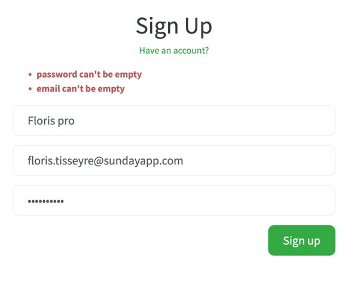
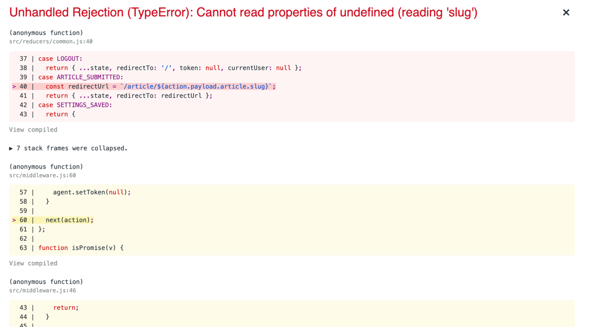

Les tickets sont triés par priorité.
La **référence** (`F` pour feature, `B` pour bug) ne change jamais et on incrémente pour les nouveaux.

# Backlog

- [x] **B3** — Le nom d'utilisateur s'affiche en double dans la barre de navigation.
  

  - **Cause :** `alt={username}` sur l'avatar — le texte alternatif s'affichait en plus du lien quand l'image ne chargeait pas
  - **Fix :** `Header.js:60` — `alt=""` (image décorative, le nom est déjà dans le lien)
  - **Vérification :** `Header.test.js` — *"displays username exactly once when logged in"* ✓

- [ ] **F1** — Brouillons : sauver un article sans le publier, retrouver ses brouillons, le publier quand il est prêt.

- [x] **B1** — La page d'accueil plante pour les utilisateurs ayant déjà visité l'application.

  - **Cause :** `middleware.js:35` — `error.response.body` crash quand `error.response` est `null` (erreur réseau lors du rafraîchissement du JWT au démarrage)
  - **Fix :** `middleware.js:35` — `error.response ? error.response.body : null`
  - **Vérification :** `middleware.test.js` — *"promiseMiddleware does not crash when error.response is null"* ✓

- **B2** — L'inscription échoue si les champs sont pré-remplis par le navigateur.

- **B4** — La publication d'un article échoue quand le champ « What's this article about? » est laissé vide.
  

- **F2** — Articles épinglés : un auteur peut épingler un de ses articles en haut de son profil.

- **F3** — Compteur de vues : afficher le nombre de vues d'un article.

- **F4** — Signalement : permettre de signaler un article avec un motif.

- **F5** — Édition de commentaire : un auteur peut modifier son commentaire après coup.

- **F6** — Recherche : chercher des articles par mot-clé.

- **F7** — Articles réservés aux abonnés : un auteur peut limiter un article à ses abonnés.

- **F8** — Archivage : retirer un article de la circulation sans le supprimer.

- **F9** — Tags suggérés : proposer des tags pendant la rédaction.

- **F10** — Notifications : prévenir quand un auteur suivi publie.

- **F11** — Renommer un article : changer le titre d'un article déjà publié.

- **F12** — Export : permettre à un auteur d'exporter ses articles.

- **F13** — Republier : un bouton qui remet un article en haut du feed.

- **F14** — Blocage : un utilisateur peut en bloquer un autre.

- [ ] **B5** — La liste « Popular Tags » de la page d'accueil reste toujours vide, même quand des articles sont publiés.

